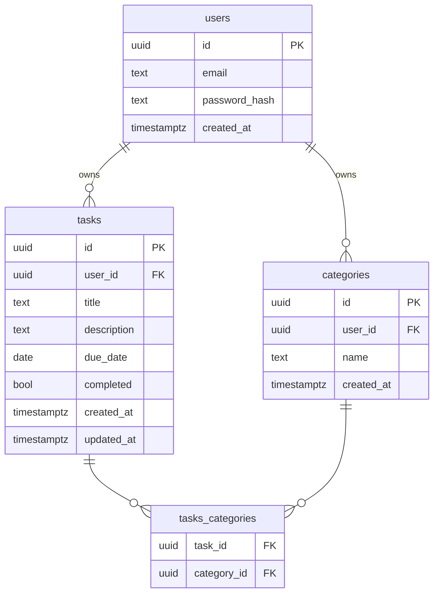
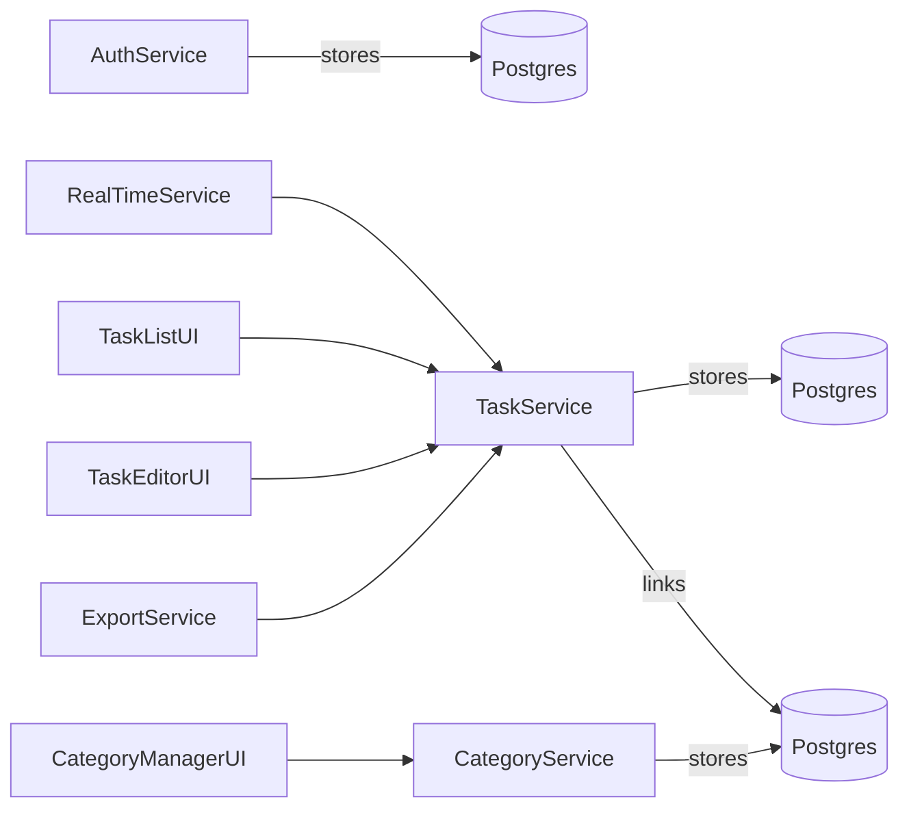

Tool Read Failure: Unable to locate or read `package.json` in the workspace. Proceeding with generic planning inputs for the Todo Web App (no existing codebase detected).

# 1. Executive Summary
We will build a responsive, secure, and extensible Todo Web Application supporting user authentication, task CRUD (create, read, update, delete), categorization (tags/projects), due-dates, and real-time updates. The architecture uses React 18 (Vite), Express 4.21, and PostgreSQL via Supabase with Row Level Security. The project follows Agile (Scrum) in three phases: MVP delivery, enhancements, and hardening/security.

# 2. Requirements

## 2.1 Functional Requirements (User Stories)
1. As an unauthenticated visitor, I can view marketing pages but must register or log in to manage todos.  
2. As a registered user, I can create new tasks with title, description, due date, and assign to a category or tag.  
3. As a user, I can edit existing tasks (change title, description, due date, category).  
4. As a user, I can mark a task as completed or reopen it.  
5. As a user, I can delete tasks.  
6. As a user, I can group tasks into categories (e.g., Work, Personal) and apply multiple tags.  
7. As a user, I can filter and sort tasks by due date, category, status, and custom search.  
8. As a user, I can reorder tasks via drag-and-drop within a list.  
9. As a user, I receive real-time updates when tasks are changed on another client (WebSocket).  
10. As a user, I can export/import my task list in JSON/CSV.  
11. As a user, I can reset my password via email link.  
12. As an admin, I can view user statistics and usage metrics.

## 2.2 Non-Functional Requirements
- Performance: API response <200 ms P95, page load ≤1 s.  
- Scalability: Support 10k concurrent users, autoscale backend on CPU >60%.  
- Security: OWASP Top 10 mitigation, HTTPS everywhere, Supabase RLS for multi-tenant data isolation.  
- Availability: 99.9% uptime, automated health checks.  
- Maintainability: 80% code coverage with unit and integration tests.  
- Accessibility: WCAG 2.1 AA compliance.  
- Localization: Prepare for multi-language (i18n).

# 3. Architecture Decision Records (ADRs)

## ADR 001: Frontend Framework
- Decision: Vite + React 18.3.1  
- Rationale: Fast development, HMR, wide community support.  
- Alternatives: Next.js (more opinionated, SSR not required for MVP).

## ADR 002: API Layer
- Decision: Express 4.21.0 with TypeScript.  
- Rationale: Familiar, lightweight, vast middleware ecosystem.  
- Alternatives: FastAPI (Python) – but team prefers Node/TS.

## ADR 003: Database
- Decision: PostgreSQL via Supabase with RLS.  
- Rationale: Managed hosting, built-in auth, real-time features.  
- Alternatives: MongoDB Atlas – lacks strong SQL relations.

## ADR 004: Real-Time Communication
- Decision: Supabase Realtime (WebSockets)  
- Rationale: Integrated with PostgreSQL changes, minimal infra.  
- Alternatives: Socket.io – more control but extra infra.

# 4. Data Model

Database schema (PostgreSQL):
- users(id UUID PK, email TEXT UNIQUE, password_hash TEXT, created_at TIMESTAMPTZ DEFAULT now())  
- categories(id UUID PK, user_id UUID FK, name TEXT, created_at TIMESTAMPTZ DEFAULT now())  
- tasks(id UUID PK, user_id UUID FK, title TEXT, description TEXT, due_date DATE, completed BOOLEAN DEFAULT false, created_at TIMESTAMPTZ DEFAULT now(), updated_at TIMESTAMPTZ DEFAULT now())  
- tasks_categories(task_id UUID FK, category_id UUID FK, PRIMARY KEY(task_id,category_id))

# 5. API Surface

| Endpoint                       | Method | Request Body                       | Response                       |
|--------------------------------|--------|------------------------------------|--------------------------------|
| POST /api/auth/register        | POST   | { email, password }                | 201 { user }                   |
| POST /api/auth/login           | POST   | { email, password }                | 200 { token }                  |
| POST /api/auth/forgot-password | POST   | { email }                          | 204                             |
| POST /api/auth/reset-password  | POST   | { token, newPassword }             | 200                             |
| GET /api/tasks                 | GET    | ?filter,sort,page,limit           | 200 [{ tasks }]                |
| POST /api/tasks                | POST   | { title, description, due_date, categories[] } | 201 { task }       |
| PUT /api/tasks/:id             | PUT    | { title, description, due_date, categories[], completed } | 200 { task } |
| DELETE /api/tasks/:id          | DELETE | —                                  | 204                             |
| GET /api/categories            | GET    | —                                  | 200 [{ categories }]           |
| POST /api/categories           | POST   | { name }                           | 201 { category }               |
| PUT /api/categories/:id        | PUT    | { name }                           | 200 { category }               |
| DELETE /api/categories/:id     | DELETE | —                                  | 204                             |
| GET /api/export                | GET    | ?format=csv|json                   | 200 { file }                   |

> All endpoints require `Authorization: Bearer <token>` except `/auth/*`.

# 6. Component Breakdown

| Component                   | Description                                 | Complexity |
|-----------------------------|---------------------------------------------|------------|
| AuthService                 | Registration, login, JWT management         | M          |
| TaskService                 | Task CRUD, filtering, sorting               | M          |
| CategoryService             | Category CRUD                               | S          |
| RealTimeService             | WebSocket subscription to task changes      | M          |
| TaskList UI                 | Task list with filtering & drag-drop        | L          |
| TaskEditor UI               | Modal/form for create/edit task             | M          |
| CategoryManager UI          | Sidebar/category CRUD                       | S          |
| ExportService               | JSON/CSV export logic                       | S          |
| CI/CD Pipeline              | Tests, linting, Docker image builds         | M          |
| Monitoring & Logging        | Health checks, Sentry integration           | M          |

# 7. Dependency Graph

# 8. Phase Plan

| Phase | Milestones                                   | Exit Criteria                          |
|-------|----------------------------------------------|----------------------------------------|
| 1: MVP| Auth, Task CRUD, Category CRUD, Basic UI     | All core stories green on CI           |
| 2: Enhancements| Real-time updates, drag-drop, filters   | End-to-end tests pass, performance goals|
| 3: Hardening| Export, password reset, accessibility, i18n| Security audit clearance, WCAG AA      |

# 9. Risk Register

| Risk                                    | Probability | Impact             | Mitigation                                        |
|-----------------------------------------|-------------|--------------------|---------------------------------------------------|
| Data leakage across tenants             | Medium      | High               | Enforce Supabase RLS policies; peer security review|
| Brute-force login attacks               | High        | Medium             | Rate-limit auth endpoints; CAPTCHA on login       |
| Performance degradation under load      | Medium      | High               | Autoscale backend, DB indexing, load testing      |
| Drag-drop library conflicts             | Low         | Low                | Choose battle-tested library (React DnD)          |
| Email deliverability issues (password)  | Medium      | Medium             | Use verified SMTP (e.g., SendGrid); monitor bounces|
- **High-risk features:** Auth, PII (emails, passwords)—recommend a dedicated security review.

